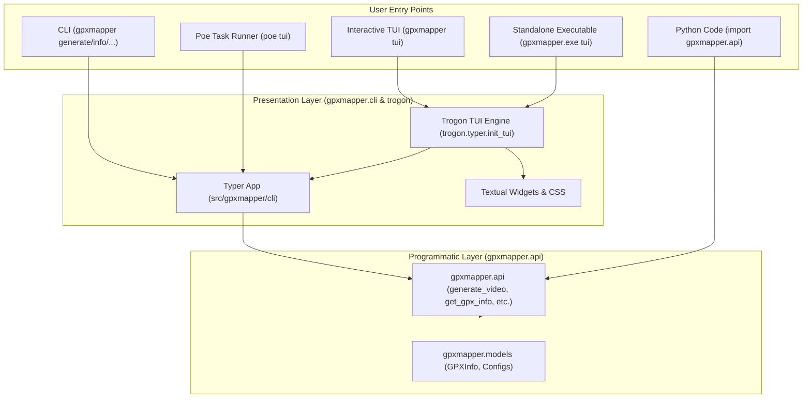

# GPXM-28: Add TUI (Terminal User Interface) Implementation Plan

**Goal:** Provide an interactive Terminal User Interface (TUI) for GPXMapper using [**Trogon**](https://github.com/Textualize/trogon) (built on [**Textual**](https://github.com/Textualize/textual)), allowing users to interactively configure options, select files, and execute `gpxmapper` commands with live visual output. Update `README.md` to reflect the TUI, programmatic API, and developer workflow.

---

## Architecture & Integration

---

## Completed Task Checklist

- [x] **1. Branch Setup**: Work on dedicated branch `feature/GPXM-28-add-tui` (branched from `feature/GPXM-27-separate-api-and-cli`).
- [x] **2. Dependency & Tooling**:
  - Added `"trogon>=0.6.0"` to `project.dependencies` in `pyproject.toml`.
  - Added `tui = "gpxmapper tui"` to `[tool.poe.tasks]`.
  - Updated PyInstaller configuration in `pyproject.toml` with `--collect-all=trogon` and `--collect-all=textual`.
- [x] **3. Command Registration**:
  - Created `src/gpxmapper/cli/tui.py` using official `trogon.typer.init_tui(app, name="gpxmapper")`.
  - Mounted `tui` in `src/gpxmapper/cli/__init__.py`.
- [x] **4. Documentation Updates (`README.md`)**:
  - Added TUI feature to the features list.
  - Added TUI usage section (`gpxmapper tui`, `poe tui`, and `gpxmapper.exe tui`).
  - Added `tui` command reference under Command-line options.
  - Added `## Development and Tasks (Poe the Poet)` task runner guide.
  - Updated Programmatic Usage section to highlight `gpxmapper.api`.
- [x] **5. Tests**:
  - Created `tests/test_tui.py` verifying command discovery in `--help`, `tui --help` exit code 0, and mocked `Trogon.run` invocation.
- [x] **6. Verification**:
  - `uv run poe check` (all 174 tests passing, 85% coverage, ruff lint & format clean).
  - `uv run poe build-exe` (PyInstaller standalone executable built).
  - Executed `./dist/gpxmapper.exe --help` and `./dist/gpxmapper.exe tui --help` (exit code 0).
  - `uv run poe docs` (documentation site built).
- [x] **7. Commitizen Validation**:
  - Followed Commitizen conventional commit format (`feat(tui): add terminal user interface with trogon`).
