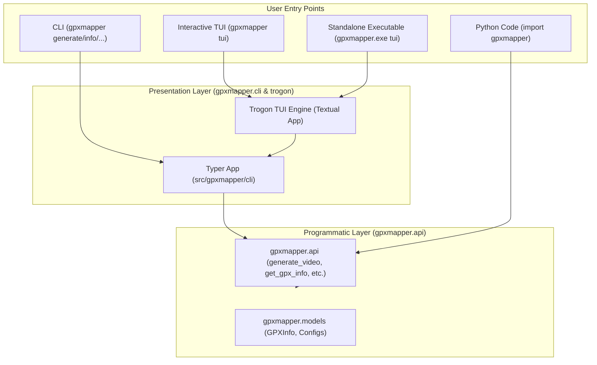

# GPXM-28: Add TUI Implementation Plan

**Goal:** Provide an interactive Terminal User Interface (TUI) for GPXMapper using [**Trogon**](https://github.com/Textualize/trogon) (built on [**Textual**](https://github.com/Textualize/textual)), allowing users to interactively configure options, select files, and execute `gpxmapper` commands with live visual output. Update `README.md` to reflect the TUI, programmatic API, and developer workflow.

---

## Architecture

---

## Task Checklist

- [ ] **1. Branch Setup**: Work on dedicated branch `feature/GPXM-28-add-tui` (branched from `feature/GPXM-27-separate-api-and-cli`).
- [ ] **2. Dependency & Tooling**:
  - Add `"trogon>=0.6.0"` to `project.dependencies` in `pyproject.toml`.
  - Add `tui = "gpxmapper tui"` to `[tool.poe.tasks]`.
  - Update `[tool.pyinstaller]` hidden imports in `pyproject.toml` for `trogon`, `textual`, `rich`, `markdown_it`, `linkify_it`.
- [ ] **3. Command Registration**:
  - Create `src/gpxmapper/cli/tui.py` with `trogon.tui(name="tui", help="Open interactive Terminal User Interface (TUI)")`.
  - Mount `tui` in `src/gpxmapper/cli/__init__.py`.
- [ ] **4. Documentation Updates (`README.md`)**:
  - Add TUI usage section (`gpxmapper tui` / `gpxmapper.exe tui`).
  - Update Programmatic Usage section to demonstrate high-level `gpxmapper` / `gpxmapper.api`.
  - Add Poe task runner reference section.
- [ ] **5. Tests**:
  - Create `tests/test_tui.py` to verify command discovery, help output, and argument structure.
- [ ] **6. Verification**:
  - Run `uv run poe check` (linting, formatting, full test suite).
  - Run `uv run poe build-exe` to ensure PyInstaller bundles the TUI cleanly.
  - Test `./dist/gpxmapper.exe tui --help`.
  - Build documentation with `uv run poe docs`.
- [ ] **7. Commitizen Validation**:
  - Verify commit message format with `scripts/check_commit_message.py`.
