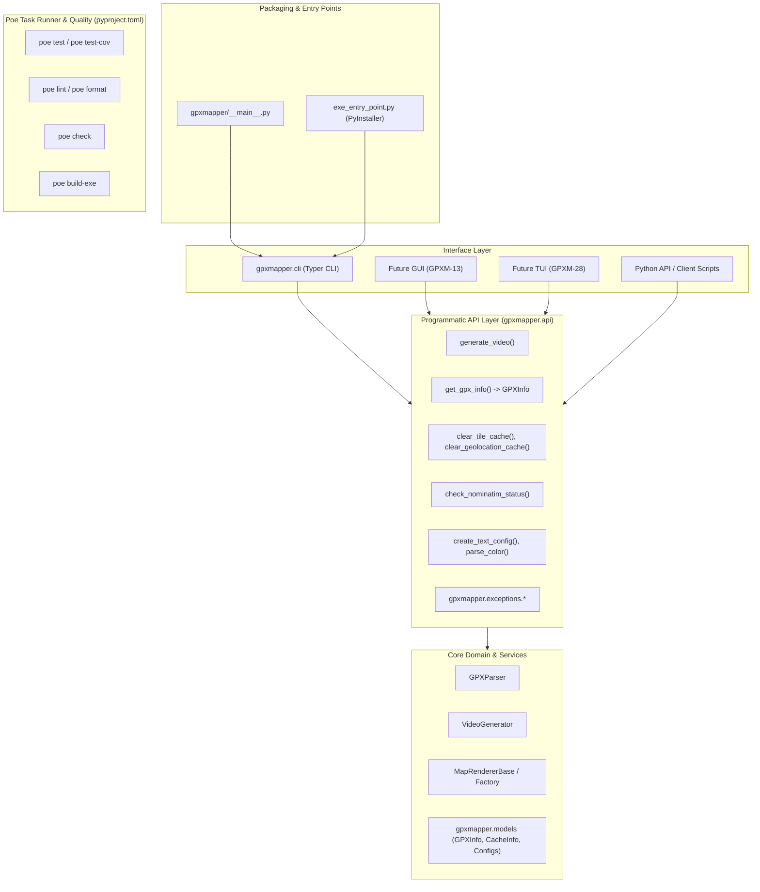

# GPXM-27: Separate API and CLI Interface Implementation Plan

**Goal:** Decouple the core GPXMapper business logic and services into a clean, reusable Python programmatic API (`gpxmapper.api`) with domain-specific exceptions (`gpxmapper.exceptions`). Refactor the CLI layer (`gpxmapper.cli`) to act as a thin presentation and interactive wrapper over this API, enabling future GUI (GPXM-13) and TUI (GPXM-28) frontends.

---

## Architecture & Design

---

## Task List

- [x] **Git Branch Setup**: Work on dedicated branch `feature/GPXM-27-separate-api-and-cli`.
- [x] **Task Execution Tool (`poethepoet`)**:
  - Add `poethepoet` to dev dependencies in `pyproject.toml`.
  - Configure tasks: `test`, `test-cov`, `lint`, `lint-fix`, `format`, `format-check`, `check`, `build-exe`, `docs`.
- [x] **Exceptions Hierarchy (`src/gpxmapper/exceptions.py`)**:
  - `GPXMapperError(Exception)` - base exception
  - `GPXParseError(GPXMapperError, ValueError)` - parsing failures
  - `GPXEmptyError(GPXParseError)` - file has no track points
  - `GPXMissingTimeError(GPXParseError)` - track points lack timestamps
  - `ConfigurationError(GPXMapperError, ValueError)` - invalid parameters/colors/alignments
  - `VideoGenerationError(GPXMapperError)` - video generation failure
  - `NominatimUnavailableError(GPXMapperError)` - service unreachable error
- [x] **Models & DTOs (`src/gpxmapper/models.py`)**:
  - `GPXInfo`: slotted dataclass with `file_path`, `point_count`, `start_time`, `end_time`, `duration`, `coordinate_bounds`.
  - `CacheInfo`: dataclass with `cache_path`, `file_count`, `exists`.
  - `CacheClearResult`: dataclass with `cache_path`, `files_deleted`, `success`, `error_message`.
- [x] **Programmatic API Layer (`src/gpxmapper/api/`)**:
  - `src/gpxmapper/api/video.py`: Programmatic `generate_video(...)` function.
  - `src/gpxmapper/api/info.py`: `get_gpx_info(...)` returning `GPXInfo`.
  - `src/gpxmapper/api/cache.py`: `get_tile_cache_info`, `clear_tile_cache`, `get_geolocation_cache_info`, `clear_geolocation_cache`.
  - `src/gpxmapper/api/config.py`: `parse_color`, `create_text_config`.
  - `src/gpxmapper/api/nominatim.py`: `check_nominatim_status`.
  - `src/gpxmapper/api/__init__.py`: Public API exports.
- [x] **Package Root Exports (`src/gpxmapper/__init__.py`)**:
  - Re-export `__version__ = "0.3.0"`.
  - Re-export public API functions, exceptions, and models.
- [x] **CLI Presentation Layer (`src/gpxmapper/cli/`)**:
  - `src/gpxmapper/cli/generate.py`: Flag parsing and delegation to `api.generate_video`.
  - `src/gpxmapper/cli/info.py`: Output formatting using `api.get_gpx_info`.
  - `src/gpxmapper/cli/clear_cache.py`: Interactive confirmation and delegation to `api.clear_tile_cache` / `api.clear_geolocation_cache`.
  - `src/gpxmapper/cli/check_nominatim.py`: Status presentation using `api.check_nominatim_status`.
  - `src/gpxmapper/cli/utils.py`: Presentation helpers and exception adapters.
- [x] **Testing & Verification**:
  - `tests/test_api.py`: Full unit tests for all `gpxmapper.api` functions.
  - `tests/test_cli.py`: Verified CLI tests against refactored layer.
  - Offline Nominatim testing: All tests run without live network endpoints.
  - PyInstaller verification: `poe build-exe` builds standalone binary and `./dist/gpxmapper.exe --help` runs cleanly.
  - Code quality: `poe check` passes all 171 tests (85% coverage), lint, and formatting.
