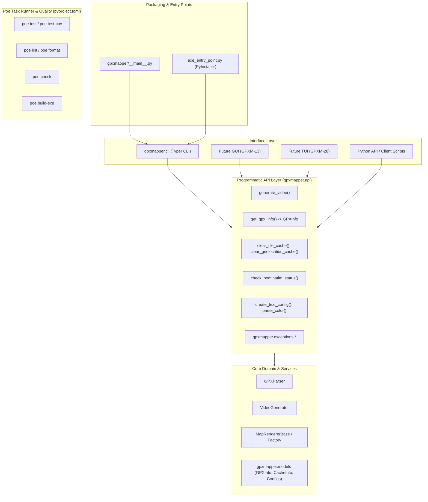

# GPXM-27: Separate API and CLI Interface

## Overview
Currently, core operations (video generation, GPX track info, tile/reverse-geocode cache operations, Nominatim status probes, and config/color parsing) are tightly coupled inside `gpxmapper.cli` and rely on `typer` exceptions (`typer.Abort`, `typer.BadParameter`, `typer.confirm`).

This refactoring decouples business logic and services into a clean, reusable Python programmatic API (`gpxmapper.api`) with domain-specific exceptions (`gpxmapper.exceptions`). The CLI layer (`gpxmapper.cli`) becomes a thin presentation and interactive wrapper over this API, enabling future GUI (GPXM-13) and TUI (GPXM-28) frontends.

---

## User Review Required

> [!IMPORTANT]
> - **PyInstaller Compatibility**: Packaging through `exe_entry_point.py`, `build_exe.py`, and `pyproject.toml` `[tool.pyinstaller]` will remain fully functional and tested.
> - **Commitizen Compatibility**: Commit messages and versioning files (`src/gpxmapper/__init__.py`, `pyproject.toml`) will strictly follow the project's Commitizen standards and `scripts/check_commit_message.py`.
> - **Dedicated Git Branch**: Work will be executed on branch **`feature/GPXM-27-separate-api-and-cli`** (branched from `master`).
> - **Poe the Poet Task Runner**: `poethepoet` will be added to `[dependency-groups] dev` with concise task aliases (`test`, `test-cov`, `lint`, `format`, `check`, `build-exe`, `docs`).
> - **Offline Nominatim Handling**: All automated tests run completely offline with mocked endpoints; no live Nominatim server is required.

---

## Proposed Architecture



---

## Proposed Changes

### 1. Git Branch Setup
- Switch to and update `master`.
- Create and switch to dedicated branch: **`feature/GPXM-27-separate-api-and-cli`**.

---

### 2. Task Execution Tool (`poethepoet`) & Dependencies

#### [MODIFY] [pyproject.toml](file:///d:/projects/python/gpxmapper/pyproject.toml)
- Add `"poethepoet>=0.29.0"` to `[dependency-groups] dev`.
- Add `[tool.poe.tasks]`:
  ```toml
  [tool.poe.tasks]
  test = "pytest"
  test-cov = "pytest --cov=gpxmapper"
  lint = "ruff check ."
  lint-fix = "ruff check --fix ."
  format = "ruff format ."
  format-check = "ruff format --check ."
  check = ["lint", "format-check", "test"]
  build-exe = "python build_exe.py"
  docs = "mkdocs build"
  ```
- Ensure `[tool.pyinstaller]` includes `gpxmapper` and subpackages.

---

### 3. Exceptions Hierarchy (`gpxmapper.exceptions`)

#### [NEW] [exceptions.py](file:///d:/projects/python/gpxmapper/src/gpxmapper/exceptions.py)
- `GPXMapperError(Exception)` - base exception
- `GPXParseError(GPXMapperError, ValueError)` - parsing failures
- `GPXEmptyError(GPXParseError)` - file has no track points
- `GPXMissingTimeError(GPXParseError)` - track points lack timestamps
- `ConfigurationError(GPXMapperError, ValueError)` - invalid parameters/colors/alignments
- `VideoGenerationError(GPXMapperError)` - video generation failure

---

### 4. Models & DTOs (`gpxmapper.models`)

#### [MODIFY] [models.py](file:///d:/projects/python/gpxmapper/src/gpxmapper/models.py)
- `GPXInfo`: slotted dataclass with `file_path`, `point_count`, `start_time`, `end_time`, `duration`, `coordinate_bounds` (min_lat, min_lon, max_lat, max_lon).
- `CacheInfo`: dataclass with `cache_path`, `file_count`, `exists`.
- `CacheClearResult`: dataclass with `cache_path`, `files_deleted`, `success`.

---

### 5. Programmatic API Layer (`gpxmapper.api`)

#### [NEW] [api/__init__.py](file:///d:/projects/python/gpxmapper/src/gpxmapper/api/__init__.py)
Exports:
- `generate_video(...) -> str`
- `get_gpx_info(gpx_file: Path | str) -> GPXInfo`
- `clear_tile_cache(cache_dir: Optional[Path | str] = None) -> CacheClearResult`
- `clear_geolocation_cache(db_path: Optional[Path | str] = None) -> CacheClearResult`
- `get_tile_cache_info() -> CacheInfo`
- `get_geolocation_cache_info() -> CacheInfo`
- `check_nominatim_status() -> tuple[bool, str, Optional[str]]`
- `parse_color(color_str: str) -> tuple[int, int, int]`
- `create_text_config(...) -> TextConfig`

#### [NEW] [api/video.py](file:///d:/projects/python/gpxmapper/src/gpxmapper/api/video.py)
- Programmatic video generation service.
- Validates track points (raises `GPXEmptyError`, `GPXMissingTimeError`).
- Configures and runs `VideoGenerator`.

#### [NEW] [api/info.py](file:///d:/projects/python/gpxmapper/src/gpxmapper/api/info.py)
- Returns `GPXInfo` from GPX file. Raises `GPXEmptyError` if empty.

#### [NEW] [api/cache.py](file:///d:/projects/python/gpxmapper/src/gpxmapper/api/cache.py)
- Pure cache operations (`get_tile_cache_info`, `clear_tile_cache`, `get_geolocation_cache_info`, `clear_geolocation_cache`).

#### [NEW] [api/config.py](file:///d:/projects/python/gpxmapper/src/gpxmapper/api/config.py)
- `parse_color` and `create_text_config` raising `ConfigurationError` on invalid inputs.

#### [NEW] [api/nominatim.py](file:///d:/projects/python/gpxmapper/src/gpxmapper/api/nominatim.py)
- `check_nominatim_status()` wrapper over `probe_nominatim_status_sync()`.

---

### 6. Package Root (`gpxmapper/__init__.py`) & PyInstaller Entry Point

#### [MODIFY] [__init__.py](file:///d:/projects/python/gpxmapper/src/gpxmapper/__init__.py)
- Re-export `__version__ = "0.3.0"` (retaining Commitizen version target).
- Re-export public API functions and models from `gpxmapper.api` and `gpxmapper.models`.

#### [VERIFY] [exe_entry_point.py](file:///d:/projects/python/gpxmapper/exe_entry_point.py)
- Verifies clean invocation of `gpxmapper.cli.app` for PyInstaller builds.

---

### 7. CLI Presentation Layer (`gpxmapper.cli`)

Thin presentation layer translating CLI options, managing terminal output and prompts, and catching API exceptions:

#### [MODIFY] [cli/generate.py](file:///d:/projects/python/gpxmapper/src/gpxmapper/cli/generate.py)
- Use `api.parse_color`, `api.create_text_config` (map `ConfigurationError` -> `typer.BadParameter`).
- Call `api.generate_video(...)` (map `GPXMapperError` -> `typer.Abort`).

#### [MODIFY] [cli/info.py](file:///d:/projects/python/gpxmapper/src/gpxmapper/cli/info.py)
- Call `api.get_gpx_info(gpx_file)`, render output with `typer.echo`.

#### [MODIFY] [cli/clear_cache.py](file:///d:/projects/python/gpxmapper/src/gpxmapper/cli/clear_cache.py)
- Use `api.get_tile_cache_info()` / `api.get_geolocation_cache_info()`.
- Interactive confirmation via `typer.confirm`.
- Perform clear via `api.clear_tile_cache()` / `api.clear_geolocation_cache()`.

#### [MODIFY] [cli/check_nominatim.py](file:///d:/projects/python/gpxmapper/src/gpxmapper/cli/check_nominatim.py)
- Use `api.check_nominatim_status()`, output colored text.

#### [MODIFY] [cli/utils.py](file:///d:/projects/python/gpxmapper/src/gpxmapper/cli/utils.py)
- Adapt calls to `gpxmapper.api` and preserve backwards compatibility.

---

### 8. Testing & Offline Nominatim Handling

#### [NEW] [tests/test_api.py](file:///d:/projects/python/gpxmapper/tests/test_api.py)
- Test all functions in `gpxmapper.api` (video generation, gpx info, cache operations, color parsing, text config).
- Ensure all tests run with mocked dependencies and without live network access.

#### [MODIFY] [tests/test_cli.py](file:///d:/projects/python/gpxmapper/tests/test_cli.py)
- Ensure all CLI command tests pass against the refactored API.

---

## Verification Plan

### Automated Verification via Poe
1. Sync environment:
   ```bash
   uv sync
   ```
2. Run code style and format checks:
   ```bash
   uv run poe lint
   uv run poe format-check
   ```
3. Run test suite and coverage:
   ```bash
   uv run poe test
   uv run poe test-cov
   ```
4. Run full validation pipeline:
   ```bash
   uv run poe check
   ```

### PyInstaller & Packaging Verification
- Run PyInstaller build test:
  ```bash
  uv run poe build-exe
  ```
- Test compiled executable:
  ```bash
  ./dist/gpxmapper.exe --help
  ```

### Commitizen Verification
- Validate commit message with `scripts/check_commit_message.py`.
