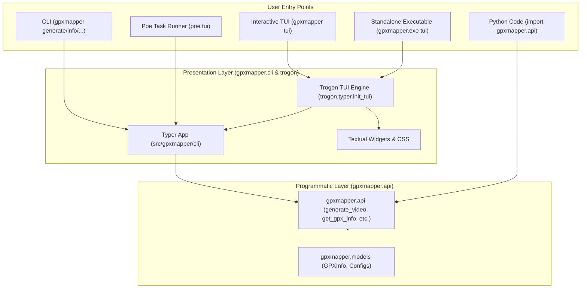

# GPXM-28: Add TUI (Terminal User Interface) Implementation Plan

## Overview
GPXM-28 introduces a Terminal User Interface (TUI) for GPXMapper to provide an interactive, visual terminal interface for generating videos, inspecting GPX tracks, and managing caches without needing to remember CLI flags.

Following the direction in the issue description, we use [**Trogon**](https://github.com/Textualize/trogon) (built on [**Textual**](https://github.com/Textualize/textual) by Textualize) to provide an interactive form-based TUI seamlessly integrated with our Typer application and underlying `gpxmapper.api`.

---

## User Review Required

> [!NOTE]
> - **Dependency**: `trogon>=0.6.0` (which brings `textual>=8.2.8`) added to `dependencies` in `pyproject.toml`.
> - **Command Access**: The TUI is accessible via `gpxmapper tui` (as well as `uv run poe tui`).
> - **PyInstaller**: PyInstaller options updated with `--collect-all=trogon` and `--collect-all=textual` so `./dist/gpxmapper.exe tui` works out of the box in standalone builds.

---

## Architecture & Integration



---

## Implementation Details

### 1. Dependencies and Configuration
- Added `trogon>=0.6.0` to `project.dependencies` in `pyproject.toml`.
- Added task alias `tui = "gpxmapper tui"` to `[tool.poe.tasks]` in `pyproject.toml`.
- Configured PyInstaller options in `pyproject.toml`:
  ```toml
  [tool.pyinstaller]
  entry_point = "exe_entry_point.py"
  options = [
      "--name=gpxmapper",
      "--onefile",
      "--console",
      "--hidden-import=gpxpy",
      "--hidden-import=typer",
      "--hidden-import=cv2",
      "--hidden-import=requests",
      "--hidden-import=PIL",
      "--hidden-import=numpy",
      "--hidden-import=zoneinfo",
      "--collect-all=trogon",
      "--collect-all=textual",
      "--specpath=.",
  ]
  ```

### 2. TUI Command Integration
- Implemented `src/gpxmapper/cli/tui.py`:
  ```python
  """TUI (Terminal User Interface) command powered by Trogon and Textual."""
  from __future__ import annotations

  from trogon.typer import init_tui

  from . import app

  # Attach trogon interactive TUI to the Typer app as `gpxmapper tui`
  init_tui(app, name="gpxmapper")
  ```
- Registered subcommand in `src/gpxmapper/cli/__init__.py`.

### 3. Automated Test Suite
- Added `tests/test_tui.py`:
  - `test_tui_command_in_cli_help`: Verifies `tui` is present in `gpxmapper --help`.
  - `test_tui_help`: Verifies `gpxmapper tui --help` exits 0 with descriptive help text.
  - `test_tui_invocation_runs_trogon`: Verifies invoking `tui` initiates `Trogon.run`.

### 4. Documentation
- Updated `README.md`:
  - Added TUI feature to the features list.
  - Added interactive TUI launch section (`gpxmapper tui`, `poe tui`, `gpxmapper.exe tui`).
  - Added `tui` subcommand documentation under Command-line options.
  - Added `## Development and Tasks (Poe the Poet)` task runner guide.
  - Added `gpxmapper.api` high-level programmatic API code examples.

---

## Verification Plan

### Automated Tests
- `uv run poe check` (runs `ruff check .`, `ruff format --check .`, `pytest --cov=gpxmapper`).

### Binary & Standalone Packaging
- `uv run poe build-exe`
- `./dist/gpxmapper.exe --help`
- `./dist/gpxmapper.exe tui --help`

### Documentation Site
- `uv run poe docs`
